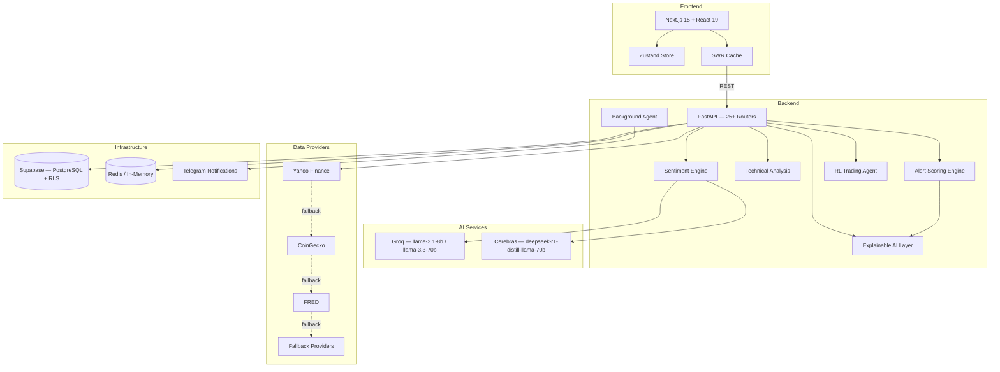

# MyInvestIA

**AI-powered investment intelligence dashboard with explainable reasoning.**

MyInvestIA is a full-stack application that combines multi-source sentiment analysis, technical indicators, and LLM-driven reasoning to surface actionable market intelligence. It aggregates data from financial APIs, scores alerts with confidence levels, and provides transparent explanations for every output. Built with FastAPI, Next.js 15, and a dual-LLM strategy for balancing speed and depth of analysis.

## Architecture



## Key Features

### Market Intelligence
- Real-time price data with provider chain failover (Yahoo Finance, CoinGecko, FRED)
- Macro indicators: VIX, DXY, treasury yields, commodities
- Multi-timeframe analysis with historical data aggregation

### AI and Sentiment Analysis
- Multi-source sentiment scoring: technical signals (45%), social sentiment (25%), news analysis (20%), price action (10%)
- Dual LLM strategy: Groq for fast inference, Cerebras for complex reasoning tasks
- All outputs include confidence scores and natural-language reasoning

### Technical Analysis
- Indicators: RSI, MACD, EMA/SMA, Bollinger Bands
- Pattern detection: support/resistance levels, trend channels
- Configurable timeframes and parameters per asset

### Portfolio Management
- Portfolio tracking with real-time valuation
- Paper trading for strategy validation
- CSV import/export for position management
- Historical performance tracking

### Alert Engine
- Confidence-scored alerts with multi-factor reasoning
- Configurable thresholds per asset and indicator
- Background agent with Telegram push notifications
- Alert history and performance tracking

### Macro Intelligence
- VIX volatility regime detection
- Dollar index (DXY) trend analysis
- Treasury yield curve monitoring
- Commodity correlation tracking

## Tech Stack

| Category | Technology |
|---|---|
| Frontend | Next.js 15, React 19, TypeScript, Zustand, Recharts, SWR |
| Backend | FastAPI, Python 3.11+, Pydantic v2, async/await |
| AI / LLM | Groq (llama-3.1-8b, llama-3.3-70b), Cerebras (deepseek-r1-distill-llama-70b) |
| Database | Supabase (PostgreSQL) with Row-Level Security |
| Cache | Redis (optional, in-memory fallback) |
| Infrastructure | Docker, Caddy reverse proxy |
| Notifications | Telegram Bot API |

## Repository Structure

```
myinvestia/
├── backend/
│   ├── app/
│   │   ├── routers/          # 25+ API route modules
│   │   ├── services/         # 60+ service modules
│   │   │   ├── sentiment/    # Multi-source sentiment engine
│   │   │   ├── technical/    # Technical analysis indicators
│   │   │   ├── alerts/       # Alert scoring and notifications
│   │   │   ├── providers/    # Data provider chain
│   │   │   ├── ai/           # LLM integration and XAI layer
│   │   │   └── macro/        # Macro intelligence services
│   │   ├── models/           # Pydantic v2 schemas
│   │   ├── core/             # Config, dependencies, middleware
│   │   └── agents/           # RL trading agent, background agent
│   ├── tests/
│   ├── requirements.txt
│   └── Dockerfile
├── frontend/
│   ├── src/
│   │   ├── app/              # Next.js app router
│   │   ├── components/       # React components
│   │   ├── stores/           # Zustand state management
│   │   ├── hooks/            # SWR hooks and utilities
│   │   └── types/            # TypeScript definitions
│   ├── package.json
│   └── Dockerfile
├── docker-compose.yml
├── Caddyfile
├── .env.example
└── README.md
```

## Quick Start

### Docker (recommended)

```bash
git clone https://github.com/yourusername/myinvestia.git
cd myinvestia
cp .env.example .env
# Edit .env with your API keys

docker compose up -d
```

The application will be available at `http://localhost:3000`.

### Manual Setup

**Backend:**

```bash
cd backend
python -m venv venv
source venv/bin/activate
pip install -r requirements.txt
uvicorn app.main:app --reload --port 8000
```

**Frontend:**

```bash
cd frontend
npm install
npm run dev
```

## Environment Variables

Copy `.env.example` to `.env` and configure the following categories:

| Category | Variables | Required |
|---|---|---|
| Market Data | `YAHOO_FINANCE_API_KEY`, `COINGECKO_API_KEY`, `FRED_API_KEY` | At least one provider |
| AI / LLM | `GROQ_API_KEY`, `CEREBRAS_API_KEY` | Yes |
| Database | `SUPABASE_URL`, `SUPABASE_ANON_KEY`, `SUPABASE_SERVICE_KEY` | Yes |
| Cache | `REDIS_URL` | No (falls back to in-memory) |
| Notifications | `TELEGRAM_BOT_TOKEN`, `TELEGRAM_CHAT_ID` | No |

## API Overview

| Endpoint Group | Path | Description |
|---|---|---|
| Market Data | `/api/v1/market/*` | Prices, quotes, historical data |
| Sentiment | `/api/v1/sentiment/*` | Multi-source sentiment scores |
| Technical | `/api/v1/technical/*` | Indicators, patterns, signals |
| Alerts | `/api/v1/alerts/*` | Alert management and history |
| Portfolio | `/api/v1/portfolio/*` | Holdings, paper trades, P&L |
| Macro | `/api/v1/macro/*` | VIX, DXY, yields, commodities |
| AI / Explain | `/api/v1/ai/*` | LLM queries, reasoning, XAI |
| Agent | `/api/v1/agent/*` | RL agent status and actions |

Full API documentation is available at `/docs` (Swagger UI) when the backend is running.

## Screenshots

<!-- Screenshot: Dashboard Overview -->

<!-- Screenshot: Sentiment Analysis Panel -->

<!-- Screenshot: Technical Analysis Charts -->

<!-- Screenshot: Alert Engine with Confidence Scores -->

<!-- Screenshot: Portfolio Tracker -->

<!-- Screenshot: Macro Intelligence View -->

## Architecture Details

### Provider Chain Pattern

Data providers are organized in a priority chain with automatic failover. When Yahoo Finance is unavailable or rate-limited, the system falls back to CoinGecko, then FRED, then cached data. Each provider implements a common interface, making it straightforward to add new sources. Responses are normalized to a unified schema regardless of the originating provider.

### Sentiment Engine Methodology

The sentiment engine combines four signal sources with empirically tuned weights:

- **Technical signals (45%):** Derived from indicator convergence/divergence across multiple timeframes. This receives the highest weight because price-derived signals have the most direct predictive relationship.
- **Social sentiment (25%):** Aggregated from community discussions and social platforms. Processed through LLM-based classification for nuance beyond keyword matching.
- **News analysis (20%):** Financial news headlines and articles scored for directional sentiment and magnitude.
- **Price action (10%):** Recent price momentum and volume patterns as a confirming signal.

The final score is a weighted composite normalized to a -1 to +1 range, accompanied by a confidence metric and a natural-language explanation generated by the AI layer.

### Alert Scoring System

Alerts are not binary triggers. Each alert carries a confidence score (0-100) computed from the strength and agreement of contributing signals. The scoring engine evaluates indicator alignment, historical accuracy of similar signal configurations, and current market regime. Alerts below a configurable confidence threshold are suppressed. Every alert includes a reasoning chain explaining which factors contributed to the score.

### Explainable AI Approach

Every AI-generated output (sentiment scores, alerts, trade suggestions) passes through an explanation layer. The system uses the dual-LLM architecture: Groq handles fast classification and scoring, while Cerebras generates detailed reasoning for high-stakes outputs. Explanations reference specific data points (indicator values, news sources, price levels) rather than generic statements. This makes the system auditable and helps users build intuition about market conditions.

## Roadmap

- **Options flow integration:** Add unusual options activity detection as an additional sentiment signal source.
- **Multi-portfolio strategies:** Support distinct strategies per portfolio with independent risk parameters and alert configurations.
- **Backtesting framework:** Historical strategy validation with configurable date ranges, slippage modeling, and performance attribution.
- **Mobile companion:** Lightweight mobile client focused on alert consumption and quick portfolio checks.

## Disclaimer

MyInvestIA is an educational and research project. It is not financial advice. The outputs of this system (including sentiment scores, alerts, and trade suggestions) should not be used as the sole basis for investment decisions. Markets are inherently unpredictable, and past performance of any model or signal does not guarantee future results. Use at your own risk.

## License

MIT License. See [LICENSE](LICENSE) for details.
