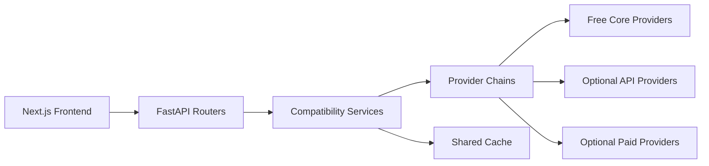

# MyInvestIA Architecture

## Scope of this phase

This document reflects the incremental architecture hardening completed in the provider-layer phase. The goal was not a destructive rewrite, but to introduce a clean data access boundary while keeping existing routers and service entrypoints stable.

## Runtime shape

### Frontend

- `frontend/`
- Next.js 15 + React 19 application
- Consumes the FastAPI backend through existing API routes and typed clients

### Backend

- `backend/app/`
- FastAPI application organized around routers, schemas, and service modules
- Redis-compatible cache support via the shared cache service
- Optional Supabase persistence
- Optional AI providers and external connectors kept outside the core market-data path

## Current backend layering

### API layer

- `backend/app/routers/*`
- HTTP contracts remain stable in this phase
- Routers continue calling legacy service names such as `market_data_service`, `get_fundamentals`, `get_company_filings`, and `get_ai_analyzed_feed`

### Domain service layer

- `backend/app/services/market_data.py`
- `backend/app/services/macro_intelligence.py`
- `backend/app/services/fundamentals_service.py`
- `backend/app/services/sec_service.py`
- `backend/app/services/news_aggregator.py`

These files now act primarily as compatibility facades. They preserve the old entrypoints but delegate data retrieval to the new provider layer.

### Provider layer

- `backend/app/services/data_providers/`

This is the new architectural boundary for external data acquisition. It standardizes:

- provider interfaces by domain
- provider priority and fallback
- response normalization
- source metadata
- retrieval-mode metadata
- free-first defaults

Key files:

- `base.py`: abstract interfaces and provider metadata descriptors
- `chain.py`: fallback and aggregation chains
- `normalization.py`: symbol, timestamp, quote, history, macro, filings, fundamentals, and news normalization
- `market.py`: Yahoo Finance first, optional paid/credentialed fallbacks isolated
- `crypto.py`: CoinGecko primary, Yahoo Finance fallback
- `macro.py`: FRED primary for official macro series, Yahoo Finance fallback for market-derived proxies
- `fundamentals.py`: Yahoo Finance normalized fundamentals
- `filings.py`: SEC EDGAR/data.sec.gov
- `news.py`: aggregated free/optional news and social feeds

## Data flow

## Architectural decisions in this phase

### 1. Compatibility first

The public backend entrypoints were kept stable. Existing routers do not need a broad rewrite to benefit from the cleaner provider model.

### 2. Free-first core

Core operation is centered on:

- Yahoo Finance
- CoinGecko
- FRED
- SEC EDGAR / `data.sec.gov`
- RSS feeds
- GDELT

Optional providers such as Bloomberg, Finnhub, Alpha Vantage, Twelve Data, and NewsAPI remain isolated and non-core.

### 3. Domain separation

The provider layer is explicitly split into:

- market data
- crypto data
- macro data
- fundamentals
- filings
- news/social feeds

This removes the old mixing of direct HTTP calls, yfinance logic, and fallback rules across unrelated service files.

### 4. Normalization at the boundary

Normalization now happens before data reaches the compatibility services. This reduces downstream branching and makes source attribution consistent.

## Source tracing

Internal normalized payloads now carry source metadata where supported:

- `source`
- `source_provider`
- `retrieval_mode`
- `as_of` or normalized timestamps

This is fully active in the provider layer and used directly by news, macro, filings, and internal market-data flows. Existing API contracts remain compatible, so not every route exposes all metadata yet.

## Caching

Caching remains centralized in `backend/app/services/cache.py`.

This phase improves cache coherence by moving provider-specific fetches behind stable cache keys in the provider layer, for example:

- market quotes and history
- crypto quotes and charts
- macro provider responses
- fundamentals payloads
- SEC company maps and filings
- news feeds

## Known limitations after this phase

- Some response models still expose only the historical public fields even though the internal payloads now carry richer source metadata.
- Fundamentals still rely on Yahoo Finance as the only current normalized provider.
- Macro context and official-series enrichment are still implemented separately from the provider layer.
- News remains an aggregation model rather than a strict first-success fallback because breadth matters more than single-source substitution in that domain.

## Recommended next architectural steps

1. Expose provider metadata in selected API response models without breaking clients.
2. Extend fundamentals and filings with additional optional public providers where quality is acceptable.
3. Unify macro context with the provider layer so official series and proxy indicators share one contract surface.
4. Introduce Redis-backed cache implementations for multi-process deployments.
5. Add contract tests around normalized payloads and provider-order configuration.
